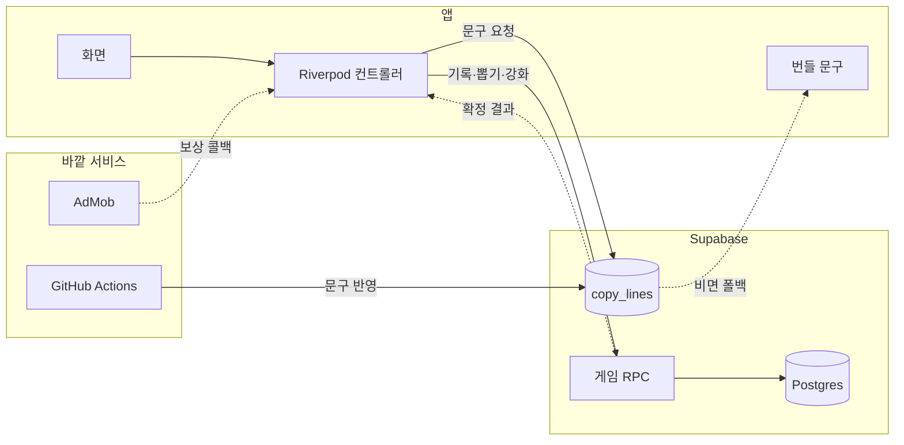

## 화면

### 홈

**파일** ./screens/01-home.png
**설명** 선행 한 번에 잎이 하나씩 붙는다

### 선행 기록

**파일** ./screens/02-record.png
**설명** 오늘 한 일을 한 줄로 적어 넣는다

### 클로버 완성

**파일** ./screens/03-clover.png
**설명** 네 장째를 채우면 클로버가 상단 배지로 날아간다

### 행운 뽑기

**파일** ./screens/04-gacha.png
**설명** 코인 하나로 캡슐 머신을 돌린다

### 행운지수

**파일** ./screens/05-fortune.png
**설명** 왕복하는 게이지를 탭한 순간이 오늘 점수가 된다

### 행운지수 결과

**파일** ./screens/06-fortune-result.png
**설명** 잡은 점수와 오늘의 색·숫자·아이템을 한 장으로 받는다

### 보관함

**파일** ./screens/07-dex.png
**설명** 뽑은 행운권이 등급별로 쌓인다

### 재료 고르기

**파일** ./screens/08-forge.png
**설명** 태울 카드를 직접 골라 성공 확률을 올린다

### 강화 연출

**파일** ./screens/09-forge-result.png
**설명** 게이지가 한 바퀴 차고 성패가 갈린다

### 나의 기록

**파일** ./screens/10-archive.png
**설명** 선행한 날이 달력에 색으로 남는다

## 데이터와 API

### Supabase

**용도** 재화·카드·기록을 서버가 들고 있고, 앱은 결과만 받는다
**방식** Postgres RPC · 익명 로그인
**갱신** 호출할 때마다
**링크** https://supabase.com/docs/guides/database/functions
**게임 규칙** 잎 적립·클로버 완성·뽑기·강화·재조합이 전부 `security definer` 함수 안에 있다. 앱은 테이블을 직접 쓰지 않는다.
**문구 배달** `copy_lines` 테이블이 홈 문구·행운지수 문구를 내려준다. 비어 있거나 장애면 앱 번들 문구로 떨어진다.
**주의** 익명 로그인 세션은 기기에 묶여서, 기기를 바꾸면 새 계정이 된다. 그래서 복구 코드를 따로 만들었다.

### Google AdMob

**용도** 광고를 보면 뽑기용 코인이 하루 다섯 개까지 들어온다
**방식** 보상형 · 전면
**갱신** 실 광고 단위
**링크** https://developers.google.com/admob/flutter/quick-start
**지급 경로** 보상형 대시보드의 리워드 수량은 표시용이고, 실제 지급은 앱이 Supabase RPC 를 불러서 한다. 클라이언트가 재화를 못 만들게 하려고 그렇게 뒀다.
**iOS** `SKAdNetworkItems` 는 구글 공식 목록 50개를 그대로 넣었고, ATT 프롬프트는 첫 프레임 뒤에 띄운다.

## 구상

- [x] 착한 일을 한 줄 적으면 잎이 하나 붙고, 네 장이 모이면 클로버가 완성된다
- [x] 모은 클로버로 소원을 조금씩 채운다
- [x] 지난 기록을 달력에서 한눈에 본다
- [ ] 한국어·영어·일본어로 같이 낸다

## 기획

**소개** 착한 일을 한 줄 적으면 잎이 하나 붙고, 네 장이 모이면 네잎클로버가 완성되는 앱이에요. 그 클로버로 행운권을 뽑고 모읍니다
**이름** 처음엔 ooloo 였는데, 가챠 쪽으로 방향을 틀면서 LuckyPicky 로 바꿨어요. "럭키비키"랑 발음이 비슷해서 입에 붙고, 골라 뽑는다는 성격에도 picky 가 맞더라고요
**사용자** 2030 여성을 주 타깃으로 잡았어요. 하루에 한두 번 잠깐 들어와 한 줄 적고 나가는 쪽이요
**기간** 6월 중순에 시작해서 두 달쯤 됐어요. 아직 스토어에는 안 올렸고요
**제약** 작업 PC 가 윈도우라 iOS 는 코드만 맞춰 두고 빌드 검증을 못 해요. 화면 확인은 전부 안드로이드 에뮬레이터에서 합니다
**넣지 않은 것** 중국어는 뺐어요. 간체·번체가 갈리고 본토 스토어는 심사와 퍼블리셔가 따로라, 혼자 감당할 운영비가 아니라서요
**넣지 않은 것** 소셜 로그인도 아직이에요. 익명 로그인으로 시작하고 복구 코드로 막아 뒀습니다

## 유저 플로우

### 오늘 한 선행을 한 줄 적는다

홈 한가운데 클로버에 잎이 하나 붙어요.

### 잎 네 장을 채운다

네 장째를 적는 순간 클로버가 완성돼서 상단 배지로 날아갑니다.

**갈라짐** 온라인 → 비행 연출 뒤 숫자가 오른다 / 오프라인 → 연출이 아예 재생되지 않는다

### 뽑기 탭에서 캡슐 머신을 돌린다

코인 한 개로 행운권 한 장이 나와요.

**갈라짐** 코인이 있다 → 바로 돌린다 / 없다 → 광고를 보고 코인을 받는다

### 보관함에서 카드를 굽는다

같은 등급 셋을 태워 재조합하거나, 여러 장을 먹여 한 장을 강화합니다.

**갈라짐** 성공 → 카드가 뒤집히며 등급이 오른다 / 실패 → 화면이 흔들리고 재료만 사라진다

### 운세 탭에서 오늘의 행운지수를 잡는다

게이지가 왕복하는 걸 탭한 순간의 값이 오늘 점수가 돼요.

## 구조

### 화면

다섯 개 탭과 연출만 그린다. 재화를 스스로 계산하지 않고, 컨트롤러가 준 숫자를 그대로 보여준다.

### Riverpod 컨트롤러

앱의 모든 상태 변경이 여기 다섯 개 메서드로 모인다. 각각 서버 RPC 하나와 짝을 이룬다.

### 게임 RPC

잎 적립, 클로버 완성, 뽑기, 강화, 재조합, 복구 코드 이관. 전부 `security definer` 라 클라이언트 권한으로는 테이블에 손댈 수 없다.

### copy_lines

홈 문구와 행운지수 문구가 `(면, 언어, 등급)` 단위로 들어 있다. 앱은 켜질 때 한 번 받아 두고, 못 받으면 번들 문구를 쓴다.

### 번들 문구

앱에 같이 실려 나가는 폴백. `dart:ui` 에 의존하지 않는 순수 dart 라, 문구 동기화 스크립트가 Flutter 없이 그대로 읽어 간다.

## 개발 과정

### 1. 착한 일을 적으면 잎이 붙는 화면부터

처음 만든 건 화면 세 개였어요. 한 줄 적으면 잎이 하나 붙고, 네 장이 되면 클로버가 되는 것. 목업을 먼저 잡아 놓고 그대로 옮겼는데, 여기서 규칙을 하나 세웠습니다. **Material 기본 모양은 하나도 쓰지 않는다.** 기본 AppBar, 잉크 리플, 보라색 시드 컬러가 한 개라도 남아 있으면 "플러터로 만든 티"가 나거든요. 버튼도 카드도 `Container` 로 직접 그리고, 색·그림자·자간은 목업 값을 그대로 옮겨 적었어요.

### 2. 소원 상점을 통째로 걷어냈어요

원래는 모은 클로버로 소원을 채우는 구조였어요. 사용자가 소원과 필요 클로버 수를 정해 두고 하나씩 담는 방식이요. 만들어 놓고 며칠 써 보니 **한 번 담고 나면 다시 열 이유가 없더라고요.** 소원 하나를 채우는 데 며칠이 걸리는데, 그 사이에 앱에서 할 게 없었어요.

그래서 소원 상점을 지우고 캡슐 머신을 넣었습니다. 클로버로 행운권을 뽑고, 뽑은 걸 보관함에 모으는 쪽으로요. 소원은 없어졌지만 매일 열어볼 이유는 생겼어요.

### 3. 재화를 전부 서버로 넘겼어요

로컬에만 저장하던 시절엔 앱을 지우면 모은 게 전부 날아갔어요. 뽑기까지 붙이고 나니 이건 더 못 미루겠더라고요. 게다가 클라이언트가 재화를 계산하면 마음만 먹으면 얼마든지 늘릴 수 있고요.

Supabase 로 옮기면서 **앱이 테이블을 직접 쓰지 못하게** 막았어요. 잎 적립도 뽑기도 강화도 전부 `security definer` 함수 안에서만 일어나고, 앱은 결과 JSON 만 받습니다. 대신 테스트용으로 똑같은 규칙을 구현한 로컬 백엔드를 하나 더 뒀어요 — 규칙을 고칠 땐 SQL 과 그 파일을 항상 같이 고칩니다.

**붙인 것** Supabase

### 4. 강화·재조합을 바텀시트에서 꺼냈어요

처음엔 카드 상세 아래에 바텀시트로 붙였어요. 좁으니까 재료를 고르는 화면이 답답했고, 무엇을 태우는지도 잘 안 보였고요. 아예 전용 화면으로 꺼내서 지갑에서 카드를 직접 골라 태우게 바꿨습니다. 강화는 대상 → 재료 두 단계, 재조합은 재료 세 장 한 단계로요.

연출도 여기서 많이 갈아엎었어요. 재료 카드가 중앙으로 빨려 들어가고, 게이지가 차고, 성공하면 카드가 뒤집히고 실패하면 화면이 흔들립니다. 그 과정에서 결과가 미리 새는 문제로 한참 고생했는데, 그건 아래 시행착오에 적었어요.

### 5. 코인과 클로버를 갈랐어요

광고 규칙을 만지다 보니 모델이 계속 어긋났어요. 클로버 하나가 곧 뽑기 한 번이면, **선행으로 만든 클로버와 광고로 받은 클로버가 구분이 안 되잖아요.** 그러면 "선행으로 운을 만든다"는 축이 통계에서부터 무너집니다.

그래서 재화를 둘로 나눴어요. 뽑기는 **광고로만 들어오는 코인**을 쓰고, 선행으로 만든 **클로버는 커스텀 행운권 제작·강화 전용**이 됩니다. 클로버는 여전히 선행으로만 생기고, 통계에도 그것만 쌓여요. 사용자가 문구를 직접 써서 만드는 커스텀 행운권도 이때 붙였습니다.

**붙인 것** Google AdMob

### 6. 문구를 앱 밖으로 뺐어요

문구를 고칠 때마다 스토어 심사를 기다리는 게 말이 안 됐어요. 그래서 문구를 Supabase 테이블에서 받아오고, 못 받으면 앱에 실린 문구로 떨어지게 했습니다. 폴백 단위를 `(면, 언어, 등급)` 조합별로 잘게 쪼개서, 한 면씩 천천히 서버로 옮겨도 안전하게요.

그 다음에 소스를 어디에 둘지로 한 번 뒤집혔는데, 그것도 시행착오에 적었습니다.

**붙인 것** GitHub Actions

### 7. 기기를 바꾸면 다 날아가는 걸 뒤늦게 알았어요

익명 로그인은 세션을 기기에 둬요. 웹은 localStorage 고요. 그래서 다른 기기에서 열면 **새 계정이 되고, 모은 게 전부 사라진 것처럼 보입니다.** 소셜 로그인을 붙이는 게 정석이지만 그건 심사·약관까지 딸려 오는 일이라, 먼저 복구 코드를 만들었어요.

계정마다 "형용사 + 뜬금없는 명사" 조합의 코드를 발급해 두고 — 명란한 참치마요 오붓한 스파게티 같은 — 새 기기에서 그 코드를 넣으면 옛 계정의 재화·카드·기록이 현재 세션으로 넘어옵니다. 세션은 건드리지 않고 서버에서만 옮기는 방식이라, 로그인 구조를 바꾸지 않고도 자산이 안 날아가요.

## 시행착오

### 광고를 어디에 붙일지 세 번 바꿨어요

**증상** 처음엔 광고를 보면 뽑기가 그냥 한 번 돌아가는 "무료 뽑기"였어요. 그런데 이러면 뽑기에 경로가 두 개가 됩니다. 클로버를 쓰는 길과 광고를 보는 길이요. 그러면 클로버가 뽑기 코인이라는 모델 자체가 흔들려요.

**시도** 먼저 클로버 완성 순간에 전면 광고를 넣었어요. 가장 기분 좋은 지점이니 여기서 받자는 계산이었는데, 완성 연출을 만들고 나니 정반대였습니다. 클로버가 배지로 날아가 숫자가 오르는 그 순간에 광고가 덮으면, 선행에 대한 보상 대신 광고가 되더라고요. 그래서 전면 광고를 도로 뺐어요.

**결론** 광고는 **얻는 순간이 아니라 쓰는 순간**에만 두기로 했어요. 무료 뽑기를 없애고, 광고를 보면 코인이 하루 다섯 개까지 들어오게 바꿨습니다. 뽑기는 언제나 코인 한 개를 쓰고요. 얻는 경로가 하나로 정리되니 재화 모델도 같이 단순해졌어요.

### 강화 결과가 연출 전에 새어 나갔어요

**증상** 재조합 카드가 뒤집히기 전에 결과가 보였어요. 게이지가 차는 동안 이미 무슨 카드인지 알 수 있으니, 뒤집는 연출이 아무 의미가 없었죠.

**시도** 처음엔 카드 텍스트가 비쳐서라고 봤어요. 회전 각도가 0에서 파이로 튀면서 앞면이 한 프레임 스치는 거라 생각하고, 결과 단계 전까지 각도를 파이에 고정했습니다. 텍스트는 안 보이게 됐는데도 여전히 새더라고요.

**결론** 색이었어요. 카드 테두리 강조색이 등급을 따라가고 있어서, **글자를 가려도 색만 보면 등급을 알 수 있었습니다.** 뒤집기 전까지는 중립색을 쓰도록 바꾸고, 뒷면 문양도 거울처럼 뒤집히지 않게 역회전을 걸었어요. 실패했을 때 흔들리는 대상도 카드에서 화면 전체로 옮겼고요.

### 서버가 규칙을 거절하면 아무 일도 안 일어났어요

**증상** 재료를 골라 강화 버튼을 눌렀는데 서버가 규칙 위반으로 거절하면, 화면이 그냥 지갑으로 돌아가 있었어요. 왜 안 됐는지도 안 나오고, 애써 고른 카드 선택도 사라져 있고요.

**시도** 처음엔 토스트 문구만 붙였습니다. 이유는 알게 됐는데, 여전히 선택은 날아가 있었어요. 실행 함수가 성공·실패를 구분하지 않고 무조건 화면을 닫고 있었거든요.

**결론** 실행 함수가 `bool` 을 돌려주게 고쳤어요. **서버 호출이 실제로 성사돼 연출까지 뜬 경우에만 true 고, 그때만 화면이 닫힙니다.** 연결 오류든 규칙 거절이든 그 외에는 선택을 그대로 유지해요. 게이지가 차는 비율도 클라이언트 예측값 대신 서버가 준 값으로 바꿨습니다 — 예측값과 실제가 어긋나면 그것도 결국 거짓말이니까요.

### 문구의 소스가 서버였다가 dart 파일로 뒤집혔어요

**증상** 처음엔 Supabase `copy_lines` 테이블을 원본으로 뒀어요. 문구를 고치려면 대시보드에서 행을 편집하고요. 그런데 이러니 **누가 언제 무슨 문구를 왜 바꿨는지가 아무 데도 안 남더라고요.** 리뷰도 안 되고, 잘못 넣으면 되돌릴 방법도 없었어요.

**시도** 만료일 컬럼을 붙여서 관리하려고 했어요. 유행어 행은 만료일 없이 못 넣게 막고, 지나면 자동으로 안 나오게요. 자동 만료는 되는데, 어떤 문구가 왜 들어왔는지는 여전히 안 남았습니다.

**결론** 소스를 dart 파일로 되돌렸어요. 문구는 git 에 남고 PR 에서 리뷰하고, main 에 머지되면 Actions 가 서버로 통째로 밀어 넣습니다. **부분 갱신이 아니라 통째로 교체하는 게 중요했어요** — 부분만 갱신하면 dart 에서 지운 문구가 서버에 남아 계속 나오거든요. 유저는 앱 업데이트 없이 새 문구를 보고, 문구 이력은 코드와 같은 곳에 쌓입니다.

여기엔 뒷이야기가 있어요. 이 파이프라인은 원래 "밈은 두세 달이면 낡으니 매달 새로 조사한다"는 전제로 만든 거였는데, 나중에 앱 전체에서 유행어를 빼기로 하면서 그 전제가 사라졌습니다. 담백한 속담 결로 가면 매달 갱신할 이유가 없어요. 배달 경로는 그대로 쓰고, 월간 리서치만 세워 뒀습니다.

### 웹에서 스플래시가 안 끝나는 줄 알았어요

**증상** 웹으로 빌드해서 열었더니 스플래시에서 안 넘어갔어요. 코드를 아무리 봐도 초기화가 안 끝날 이유가 없었고요.

**시도** 한동안은 **웹 빌드 자체가 안 되는 거라고 잘못 알고 있었어요.** 광고 라이브러리가 모바일 전용이라 웹 컴파일을 막는다고 적어 두고 그냥 넘겼는데, 나중에 다시 해 보니 `flutter build web` 이 멀쩡히 성공하더라고요. 광고 컨트롤러에 이미 비-모바일 스킵 가드가 있었습니다.

**결론** 무한 로딩은 **서비스 워커가 붙들고 있던 옛 빌드**였어요. 재배포해도 브라우저가 캐시된 낡은 산출물을 계속 띄운 거죠. 코드는 처음부터 정상이었고요. `--pwa-strategy=none` 으로 빌드하거나 캐시 헤더를 막으면 해결됩니다. 원인을 두 번 잘못 짚은 셈이라 기억에 남아요.

### 에뮬레이터에서 아무것도 안 눌렸어요

**증상** 앱이 뜨긴 하는데 탭이 하나도 안 먹었어요. 자동화 스크립트로 좌표를 찍어도 반응이 없고, 손으로 눌러도 그대로였고요.

**시도** 터치 이벤트를 가로채는 위젯이 있나부터 봤어요. 포커스가 어디 있는지 `dumpsys` 로 확인했더니 앱을 가리키고 있어서, 앱 안쪽 문제라고 보고 오버레이 위젯들을 하나씩 뜯었습니다. 아무것도 안 나왔고요.

**결론** 화면을 직접 찍어 보니 **"시스템 UI가 응답하지 않음" 다이얼로그**가 앱 위에 떠서 터치를 전부 삼키고 있었어요. 포커스 정보는 여전히 앱을 가리키니 그걸 믿으면 안 되는 거였죠. 오래된 스냅샷에서 복원된 에뮬레이터 상태가 원인이라, 그 뒤로는 콜드 부트로 띄웁니다. 소프트웨어 렌더링으로 돌리면 이 PC 에서는 오히려 더 자주 나서 그 옵션은 안 써요.

## 남은 것

- 개발자 웹사이트 도메인이 아직 없어요. 이것 하나가 없어서 `app-ads.txt` 와 개인정보처리방침이 만들어만 두고 걸리지를 못합니다.
- 웹 빌드를 공개하면 재화 경제가 깨져요. 웹에는 광고가 없어서 보상형이 즉시 지급되기 때문에, 공개하려면 웹에서 보상 버튼을 막는 가드가 먼저 필요합니다.
- 소셜 로그인이 없어요. 복구 코드로 급한 불은 껐지만, 결국 Google·Apple 계정 연동으로 가야 합니다.
- iOS 는 코드만 맞춰 뒀어요. 빌드와 심사 검증은 Mac 이 있어야 합니다.
- 월간 문구 리서치 루틴이 멈춰 있어요. 유행어를 뺀 뒤로 매달 갱신할 이유가 사라져서, 다시 돌릴지는 아직 안 정했습니다.
